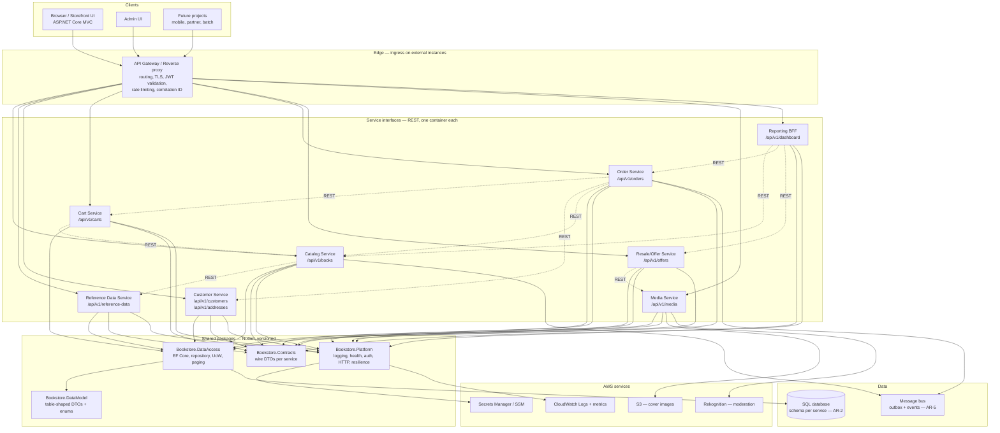
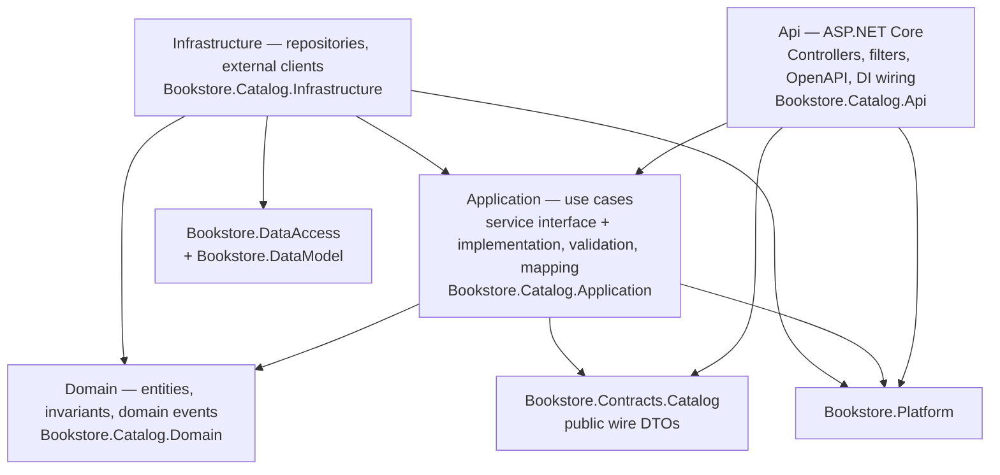
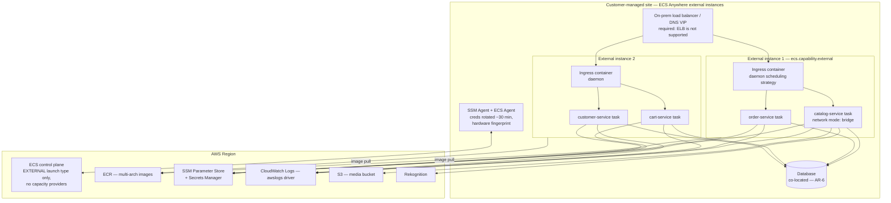
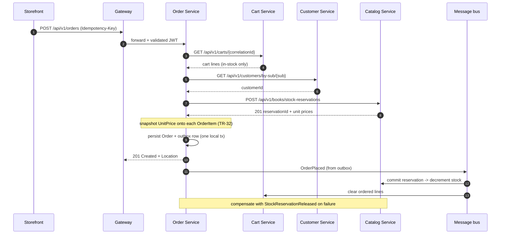

# Bookstore Microservices Modernization — Steering Document

**Audience:** AWS Transform (ATX) for .NET, Kiro, and the human engineers reviewing the output.
**Source system:** `BobsBookstoreClassic.sln` (.NET Framework 4.8 ASP.NET MVC 5 monolith).
**Target system:** .NET 10 microservices, REST service interfaces, shared data model + shared data access layer, hosted on **Amazon ECS Anywhere** (`EXTERNAL` launch type).

This document is normative. Where a rule is numbered (`TR-*`, `CS-*`, `MP-*`, `AR-*`), cite the number in commit messages, PR descriptions, and ATX plan feedback so decisions are traceable.

---

## Contents

1. [Scope and division of labour](#1-scope-and-division-of-labour)
2. [As-is architecture (verified)](#2-as-is-architecture-verified)
3. [Target architecture](#3-target-architecture)
4. [Service decomposition](#4-service-decomposition)
5. [Shared layers](#5-shared-layers)
6. [Data access layer specification](#6-data-access-layer-specification)
7. [REST service interface standards](#7-rest-service-interface-standards)
8. [ECS Anywhere hosting and infrastructure as code](#8-ecs-anywhere-hosting-and-infrastructure-as-code)
9. [Coding standards](#9-coding-standards)
10. [Migration preferences](#10-migration-preferences)
11. [Transformation rules](#11-transformation-rules)
12. [Out of scope / do not transform](#12-out-of-scope--do-not-transform)
13. [Definition of done](#13-definition-of-done)
14. [Open decisions requiring sign-off](#14-open-decisions-requiring-sign-off)

---

## 1. Scope and division of labour

AWS Transform for .NET **ports** code; it does not decompose a monolith. Treat this as two distinct bodies of work and do not conflate them.

| Phase | Owner | Output |
|---|---|---|
| **Phase 1 — Port** | AWS Transform for .NET | `net10.0` SDK-style projects, EF Core, ASP.NET Core. Same project boundaries as today. Builds and runs in a Linux container. |
| **Phase 2 — Extract shared layers** | Kiro + engineers | `Bookstore.DataModel`, `Bookstore.DataAccess`, `Bookstore.Contracts`, `Bookstore.Platform` as independently versioned packages. |
| **Phase 3 — Split services** | Kiro + engineers | One deployable per bounded context, each with a REST interface. Strangler-fig cutover behind the gateway. |
| **Phase 4 — Host** | Engineers | ECS Anywhere cluster, external instances, ingress, observability — provisioned by **Terraform** (`§8.1`). |

ATX facts that constrain Phase 1 ([supported versions](https://docs.aws.amazon.com/transform/latest/userguide/dotnet.html)):

- Transform-from `.NET Framework 3.5 … .NET 10`; transform-to **`.NET 8`, `.NET 10`, `.NET Standard`** (class libraries). This repo targets **`.NET 10` (LTS)** — see `AR-1`.
- Supported project types include class libraries and ASP.NET MVC — covers every project here.
- ATX requires a solution file. `BobsBookstoreClassic.sln` exists at the repo root; keep it present and buildable until Phase 1 is accepted.
- ATX will ask for human input on: source connector setup, modernization-plan validation, missing NuGet uploads, and final code acceptance. Plan for those gates.

`AR-1` **Target framework is `net10.0`.** .NET 8 reaches [end of support on 10 November 2026](https://devblogs.microsoft.com/dotnet/dotnet-8-9-end-of-support/); starting a multi-month migration onto it would land out of support before go-live. Do not emit `net8.0` in any project file. (Content rephrased for compliance with licensing restrictions.)

---

## 2. As-is architecture (verified)

Read from the repository, not assumed:

| Project | Framework | Role | Notes |
|---|---|---|---|
| `app/Bookstore.Web` | net48 | ASP.NET MVC 5 UI | `Global.asax`, `App_Start`, OWIN `Startup.cs`, `Web.config`, `Areas/Admin`, `Dockerfile` |
| `app/Bookstore.Domain` | net48 | Entities, DTOs, services, repository interfaces | No external dependencies — only BCL references |
| `app/Bookstore.Data` | net48 | EF 6.5.1 repositories, S3, Rekognition, Magick.NET | `packages.config`-era `<Reference>` + `HintPath` to `..\..\packages\` |
| `app/Bookstore.Common` | net48 | One constant (`AppName = "BobsUsedBooksClassic"`) | Candidate for deletion |
| `app/Bookstore.Cdk` | SDK-style (net9.0) | AWS CDK in C#: `NetworkStack`, `CoreStack`, `DatabaseStack`, `EcsStack` | Targets Fargate/EC2 today, not `EXTERNAL`. **Being retired — infrastructure moves to Terraform (`§8.1`, `TR-48`).** |

Current dependency direction: `Web → Data → Domain`, with `Web → Domain`. `Domain` owns the service classes *and* their interfaces (e.g. `IOrderService` and `OrderService` both live in `Orders/OrderService.cs`).

HTTP surface today — 9 storefront controllers (`Address`, `Authentication`, `Checkout`, `Home`, `Orders`, `Resale`, `Search`, `ShoppingCart`, `Wishlist`) and 6 admin controllers in `Areas/Admin/Controllers` (`Dashboard`, `Inventory`, `Offers`, `Orders`, `ReferenceData`, `Error`).

### Decomposition blockers found in the code

These are the things that will break a naive split. Every one has a transformation rule in [§11](#11-transformation-rules).

1. **One `DbContext`, one unit of work across all aggregates.** `Bookstore.Data/ApplicationDbContext.cs` holds `Address`, `Book`, `Customer`, `Order`, `ShoppingCart`, `OrderItem`, `Offer`, `ReferenceData`. `OrderService.CreateOrderAsync` relies on this explicitly — its own comment states that changes to the cart and to stock levels can be persisted by calling `SaveChangesAsync` on *any* repository. Cross-aggregate atomicity is load-bearing today and disappears the moment services are split. → `TR-30`, `TR-31`
2. **`Order` reads live `Book` prices.** `Order.SubTotal => OrderItems.Sum(x => x.Book.Price)` and `Order.AddOrderItem(Book book, int quantity)` (`Bookstore.Domain/Orders/Order.cs`). An order's total is recomputed from the catalogue on every read, so a later price change silently rewrites historical orders. This is a correctness bug today and an impossible dependency after the split. → `TR-32`
3. **`Order` navigates to `Customer` and `Address`.** Navigation properties plus `modelBuilder.Entity<Order>().HasRequired(x => x.Customer)`. → `TR-33`
4. **`Book` and `Offer` each carry four required FKs to `ReferenceDataItem`** (`PublisherId`, `BookTypeId`, `GenreId`, `ConditionId`) with `HasRequired(...).WillCascadeOnDelete(false)`. → `TR-34`
5. **`OrderService` injects three repositories** (`IOrderRepository`, `IShoppingCartRepository`, `ICustomerRepository`) — a cross-context orchestration already, just in-process. → `TR-31`
6. **`DateTime.Now` in domain logic.** `Order.DeliveryDate = DateTime.Now.AddDays(7)`. Containers run UTC; this changes behaviour on migration. → `TR-20`
7. **`Database.SetInitializer(new BookstoreDbInitializer())`** inside `OnModelCreating` — EF6 initializer pattern with no equivalent in EF Core. → `TR-13`

---

## 3. Target architecture

### 3.1 Logical view



### 3.2 Per-service internal layering

Every service is built the same way. Dependencies point inward and downward only; there are no upward or sideways references.



`AR-3` **The service interface is an interface, not a class.** Each use case is declared as a C# interface in `*.Application` (continuing the existing `IOrderService` / `OrderService` pattern) and exposed over HTTP by a thin controller in `*.Api`. Controllers contain no business logic — routing, model binding, authorization attributes, and a single call into the application service.

`AR-4` **`Infrastructure` depends on `Application`, never the reverse.** `*.Application` declares `IBookRepository`; `*.Infrastructure` implements it. `*.Api` references `*.Infrastructure` solely to register DI at startup.

### 3.3 Deployment view — ECS Anywhere



### 3.4 Checkout — the cross-service flow that replaces the shared unit of work



---

## 4. Service decomposition

One bounded context per service. The "Source" column is binding: code moves from exactly these locations, and nothing else moves with it.

| Service | Source (move from) | Owns tables | Public base route |
|---|---|---|---|
| **Catalog** | `Domain/Books/*`, `Data/Repositories/BookRepository.cs`, `Controllers/SearchController.cs`, `Areas/Admin/Controllers/InventoryController.cs` | `Book` | `/api/v1/books` |
| **Reference Data** | `Domain/ReferenceData/*`, `Data/Repositories/ReferenceDataRepository.cs`, `Areas/Admin/Controllers/ReferenceDataController.cs` | `ReferenceData` | `/api/v1/reference-data` |
| **Customer** | `Domain/Customers/*`, `Domain/Addresses/*`, `Data/Repositories/CustomerRepository.cs`, `Data/Repositories/AddressRepository.cs`, `Controllers/AddressController.cs`, `Controllers/AuthenticationController.cs` | `Customer`, `Address` | `/api/v1/customers`, `/api/v1/addresses` |
| **Cart** | `Domain/Carts/*`, `Data/Repositories/ShoppingCartRepository.cs`, `Controllers/ShoppingCartController.cs`, `Controllers/WishlistController.cs` | `ShoppingCart`, `ShoppingCartItem` | `/api/v1/carts` |
| **Order** | `Domain/Orders/*`, `Data/Repositories/OrderRepository.cs`, `Controllers/OrdersController.cs`, `Controllers/CheckoutController.cs`, `Areas/Admin/Controllers/OrdersController.cs` | `Order`, `OrderItem` | `/api/v1/orders` |
| **Resale / Offer** | `Domain/Offers/*`, `Data/Repositories/OfferRepository.cs`, `Controllers/ResaleController.cs`, `Areas/Admin/Controllers/OffersController.cs` | `Offer` | `/api/v1/offers` |
| **Media** | `Domain/IFileService.cs`, `IImageValidationService.cs`, `IImageResizeService.cs`, `Data/FileServices/*`, `Data/ImageResizeService/*`, `Data/ImageValidationServices/*` | none (S3) | `/api/v1/media` |
| **Reporting BFF** | `Areas/Admin/Controllers/DashboardController.cs`, `BookStatistics`, `OfferStatistics`, `OrderStatistics` | none (read-only fan-out) | `/api/v1/dashboard` |
| **Storefront UI** | `Bookstore.Web` Views, Content, Scripts, Helpers, `Controllers/HomeController.cs` | none | `/` |

Rules:

- `MP-1` **Reference Data and Media are extracted first.** They have the fewest inbound dependencies and prove the shared-package and ECS Anywhere pipeline before anything revenue-bearing moves.
- `MP-2` **Order is extracted last.** It is the only service that orchestrates three others.
- `MP-3` **`Bookstore.Common` is deleted.** Its single constant moves to `Bookstore.Platform` as configuration, not a compile-time literal.
- `MP-4` **No service reads another service's tables.** No cross-schema joins, no cross-service `DbContext`, no linked servers. The only ways across a boundary are the REST interface and published events.
- `MP-5` **Wishlist stays inside Cart.** `WishlistController` is served by the Cart service with a list-type discriminator; it is not its own deployable.

---

## 5. Shared layers

Four packages, versioned and published independently so future projects can consume them without taking the bookstore with them.

```
shared/
  Bookstore.DataModel/            # table-shaped DTOs + enums. No behaviour, no EF, no AWS.
  Bookstore.DataAccess/           # EF Core + repository/UoW over DataModel. No service-specific code.
  Bookstore.Contracts/            # wire DTOs per service, one assembly per bounded context.
  Bookstore.Platform/             # cross-cutting: logging, health, auth, HTTP clients, resilience.
```

`AR-7` **`Bookstore.DataModel` and `Bookstore.Contracts` are two different things and must never be merged.** `DataModel` is shaped by the database; `Contracts` is shaped by the API. Returning a `DataModel` type from a controller is a review-blocking defect — it welds the public contract to the table layout and makes every schema change a breaking API change.

### 5.1 `Bookstore.DataModel` — the shared data model layer

- `CS-10` Target `netstandard2.1` **and** `net10.0` (multi-target) so future projects on older runtimes can consume it. No other TFMs.
- `CS-11` Allowed dependencies: **none**. Not EF Core, not `System.Text.Json` attributes, not AWS SDK, not `Bookstore.*`. If a type needs a dependency, it belongs elsewhere.
- `CS-12` One type per table, named exactly after the table (`Book`, `OrderItem`, `ReferenceDataItem`). Property names match column names. The relationship is 1:1 and verifiable by reading the file.
- `CS-13` Declared as `public sealed class` with `public` settable properties and a public parameterless constructor — EF Core materializes these. Do **not** use `record` with positional parameters for table types.
- `CS-14` Column types are explicit and lossless: `decimal` for money (never `double` or `float`), `DateTimeOffset` for instants, `int` for identity keys, `string?` for nullable text. Preserve the existing `nvarchar(450)` constraint on `Customer.Sub` and its unique index.
- `CS-15` Enums that exist in the database as `int` (`OrderStatus`, `OfferStatus`, `ReferenceDataType`) live here with **explicit numeric values** matching current persisted data. Never reorder them.
- `CS-16` No navigation properties across a service boundary. Foreign keys are plain scalars. Navigation inside one aggregate (`Order` → `OrderItem`) is permitted.
- `CS-17` No computed properties and no methods. `IsInStock`, `SubTotal`, `Tax`, `Total`, `ReduceStockLevel` do **not** come here — they are domain behaviour and move to the owning service's `*.Domain`.

### 5.2 `Bookstore.DataAccess` — the common data access layer

- `CS-20` Target `net10.0`. Depends on `Bookstore.DataModel`, EF Core 10, and nothing bookstore-specific.
- `CS-21` Provides generic, reusable primitives only:
  - `IRepository<TEntity, TKey>` — `GetAsync`, `ListAsync`, `AddAsync`, `Remove`, `SaveChangesAsync`
  - `IUnitOfWork` — explicit `BeginTransactionAsync` / `CommitAsync`, scoped to **one** service
  - `BookstoreDbContextBase` — conventions, UTC conversion, soft timestamps, concurrency token wiring
  - `PagedResult<T>` and `IPagedQuery` — replacing `IPaginatedList<T>` / `PaginatedList`
  - `IEntityTypeConfiguration<T>` base helpers and a connection-resiliency policy
  - An outbox table abstraction (`OutboxMessage`) and dispatcher hook
- `CS-22` **No `IQueryable` crosses the package boundary.** Repository methods return materialized results. Leaking `IQueryable` lets callers compose queries the owner cannot index or audit.
- `CS-23` Each service defines its own `DbContext` deriving from `BookstoreDbContextBase`, with its own `IEntityTypeConfiguration<T>` set and its own schema. `Bookstore.DataAccess` ships **zero** `DbSet` declarations.
- `CS-24` Mapping is done with `IEntityTypeConfiguration<T>` classes, one file per table. Never with data annotations, and never with a 40-line `OnModelCreating` like the current one.
- `CS-25` Migrations live in the owning service's `*.Infrastructure` project. The shared package contains no migrations.
- `CS-26` Mapping between `DataModel` and `Contracts` is explicit hand-written code in `*.Application`. No reflection-based auto-mappers — a renamed property must break the build, not silently return null.

### 5.3 `Bookstore.Contracts`

- `CS-30` One assembly per bounded context: `Bookstore.Contracts.Catalog`, `.Orders`, `.Customers`, `.Carts`, `.Offers`, `.ReferenceData`, `.Media`.
- `CS-31` Multi-target `netstandard2.1;net10.0`. No dependency on `DataModel`, `DataAccess`, or any service.
- `CS-32` Request/response types are `public sealed record` with `required` members where mandatory. Enums are serialized as strings over the wire.
- `CS-33` Namespaces are version-scoped: `Bookstore.Contracts.Orders.V1`. A `V2` namespace is added alongside; `V1` is never edited after release.
- `CS-34` Also contains the published event contracts (`OrderPlaced`, `StockReserved`, `OfferApproved`) — same versioning rule.

### 5.4 `Bookstore.Platform`

- `CS-40` Serilog structured logging with a correlation-ID enricher, `AddHealthChecks` wiring for `/health/live` and `/health/ready`, JWT bearer configuration, `IHttpClientFactory` registrations with Polly retry + circuit breaker + timeout, `ProblemDetails` factory, and configuration binding from environment variables, SSM Parameter Store, and Secrets Manager.
- `CS-41` Exposes `AddBookstorePlatform(this IHostApplicationBuilder)` as the single entry point. Services call it once in `Program.cs`.
- `CS-42` Contains no business logic and no `DataModel` reference.

### 5.5 Package versioning

- `CS-45` SemVer, enforced. A breaking change to `DataModel` or `Contracts` is a major bump and requires a migration note in the package release notes.
- `CS-46` Central Package Management (`Directory.Packages.props`) at the repo root. No version numbers in individual `.csproj` files.
- `CS-47` Shared packages are published to CodeArtifact and consumed by version. Services do **not** `ProjectReference` the shared layers once Phase 2 completes — that is what keeps them reusable by future projects rather than coupled to this repo's build.

---

## 6. Data access layer specification

### 6.1 DTO-to-table mapping

The contract the user asked for: **`Bookstore.DataModel` types map 1:1 onto table structure.**

| Table | DataModel type | Mapping notes |
|---|---|---|
| `Book` | `Book` | `PublisherId`, `BookTypeId`, `GenreId`, `ConditionId` stay as `int` FKs. Navigation properties to `ReferenceDataItem` are **removed** (`TR-34`). |
| `Offer` | `Offer` | Same four FKs, same removal. |
| `ReferenceData` | `ReferenceDataItem` | Keep the explicit `ToTable("ReferenceData")` — the table is singular and does not match the type's plural-ish name. |
| `Customer` | `Customer` | `Sub` is `nvarchar(450)`, unique index retained. |
| `Address` | `Address` | — |
| `Order` | `Order` | `CustomerId`, `AddressId` as scalars only (`TR-33`). |
| `OrderItem` | `OrderItem` | Gains `UnitPrice`, `BookTitle`, `BookIsbn` snapshot columns (`TR-32`). |
| `ShoppingCart` | `ShoppingCart` | — |
| `ShoppingCartItem` | `ShoppingCartItem` | Composite key `(Id, ShoppingCartId)` with `Id` identity-generated — preserve exactly. |
| `OutboxMessage` | `OutboxMessage` | New. One per service schema. |

- `CS-50` Table and column names are **preserved byte-for-byte** from the current schema. Renaming is a separate, explicitly approved change — never a side effect of porting.
- `CS-51` Every `IEntityTypeConfiguration<T>` states `ToTable`, `HasKey`, and explicit column types for all `decimal` and `string` properties. No reliance on EF Core convention for anything persisted.
- `CS-52` `DeleteBehavior.Restrict` everywhere, matching the current `WillCascadeOnDelete(false)`. No cascade deletes.
- `CS-53` Add a `rowversion`/`xmin` concurrency token to `Book` and `Order`. Stock decrement without optimistic concurrency oversells under load, and `ReduceStockLevel` is a read-modify-write today.

### 6.2 Query rules

- `CS-55` All data access is `async` with a `CancellationToken` threaded from the controller. No `.Result`, no `.Wait()`, no `.GetAwaiter().GetResult()`.
- `CS-56` Read-only queries use `AsNoTracking()`.
- `CS-57` Every list endpoint is paginated. Default page size 10 (matching today's `pageSize = 10`), maximum 100, returned in a `PagedResult<T>` envelope.
- `CS-58` No `SELECT *` into an entity when a projection suffices. Project to the `Contracts` type in the query where the shape allows.
- `CS-59` Raw SQL only via parameterized `FromSqlInterpolated`. String-concatenated SQL is a blocking defect.
- `CS-60` Connection strings and credentials come from Secrets Manager via `Bookstore.Platform`. Never `Web.config`, never `App.config`, never a literal in code. Delete `Bookstore.Data/App.config`.

---

## 7. REST service interface standards

- `CS-70` **Routes:** kebab-case plural nouns, version in the path — `/api/v1/books`, `/api/v1/reference-data`. No verbs in routes; the HTTP method is the verb.
- `CS-71` **Methods and status codes:**
  | Action | Method | Success | Notes |
  |---|---|---|---|
  | list | `GET /api/v1/books` | 200 + `PagedResult<T>` | filters as query string |
  | read | `GET /api/v1/books/{id}` | 200 / 404 | |
  | create | `POST /api/v1/books` | 201 + `Location` header | returns the created id |
  | full update | `PUT /api/v1/books/{id}` | 204 | |
  | partial update | `PATCH /api/v1/books/{id}` | 204 | JSON Merge Patch |
  | state transition | `POST /api/v1/orders/{id}/cancellation` | 202 / 204 | sub-resource, not a verb route |
  | delete | `DELETE /api/v1/books/{id}` | 204 / 404 | |
- `CS-72` **Errors:** RFC 9457 `ProblemDetails` for every non-2xx, with `type`, `title`, `status`, `detail`, `instance`, and a `traceId`. 400 for validation (include a `errors` dictionary), 401/403 for auth, 404 for missing, 409 for concurrency or business-rule conflict, 422 for semantically invalid but well-formed input. Never return a stack trace or an SQL error message to a client.
- `CS-73` **Idempotency:** `POST /api/v1/orders` and any other non-idempotent money-moving endpoint requires an `Idempotency-Key` header; the service stores the key with the result and replays it on retry. Required because cross-service calls will be retried by the resilience policy.
- `CS-74` **Serialization:** `System.Text.Json`, camelCase, enums as strings, `DateTimeOffset` in ISO-8601 UTC, nulls omitted. Set this once in `Bookstore.Platform`.
- `CS-75` **OpenAPI:** every service publishes `/openapi/v1.json` at build time; the document is committed and diffed in CI. An uncommitted contract change fails the build.
- `CS-76` **Versioning:** additive changes only within `v1`. Removing or retyping a field means `v2` alongside `v1`, with `v1` kept for at least one release cycle.
- `CS-77` **Auth:** JWT bearer validated at the gateway **and** independently in each service. Never trust a gateway-injected identity header alone — any workload on the same bridge network can forge it. Admin endpoints require a distinct scope/role claim, replacing today's `AdminAreaControllerBase` convention.
- `CS-78` **Health:** `/health/live` (process up, no dependency checks) and `/health/ready` (database reachable, required downstreams reachable). `live` must not touch the database, or a database blip will cause a restart storm.
- `CS-79` **Correlation:** accept `traceparent` / `X-Correlation-ID`, generate if absent, propagate on every outbound call, and include it in every log line and `ProblemDetails`.
- `CS-80` **Timeouts:** every outbound HTTP call has an explicit timeout (default 5 s), retry with jittered backoff (3 attempts, idempotent requests only), and a circuit breaker. No infinite waits — on-prem to cloud links fail differently from in-VPC ones.

---

## 8. ECS Anywhere hosting and infrastructure as code

ECS Anywhere is materially more restrictive than Fargate or EC2. These constraints drive architecture, not the other way around. Source: [EXTERNAL launch type considerations](https://docs.aws.amazon.com/AmazonECS/latest/developerguide/ecs-anywhere.html).

| Constraint | Consequence for this migration |
|---|---|
| **Windows is deprecated for ECS Anywhere**; supported OS are Amazon Linux 2023, Ubuntu 20/22/24, RHEL 9 (x86_64 and ARM64) | Linux containers only. The .NET Framework 4.8 → .NET 10 port is **mandatory**, not optional. No Windows container escape hatch. |
| **Service load balancing is not supported** | No ALB/NLB target registration. You must run your own ingress (nginx / Traefik / Envoy) as an ECS **daemon** service on the external instances, fronted by on-prem DNS or an on-prem load balancer. Budget for this; it is not a one-line change. |
| **Service discovery is not supported** (no Cloud Map) | Service-to-service addressing must be self-managed: static DNS per service behind the ingress, or a registry you operate. Do not write code that assumes Cloud Map DNS names. |
| **`awsvpc` network mode is not supported** — only `bridge`, `host`, `none` | Use `bridge` with explicit host port mappings, or `host` for the ingress. No per-task ENI, no per-task security group: **network isolation between services does not exist**, which is exactly why `CS-77` requires in-service JWT validation. |
| **Capacity providers are not supported** | `launchType: EXTERNAL` on every service and task. No managed scaling — capacity is whatever hardware is registered. Use `daemon` strategy for ingress and `replica` with placement constraints on `ecs.capability.external` plus custom attributes for the rest. |
| **EFS / `EFSVolumeConfiguration` is not supported** | Services must be stateless. All media goes to S3 via the Media service. No shared file volume for uploads — note that `LocalFileService` exists today and must not be used in the deployed configuration. |
| **App Mesh integration is not supported** | No service mesh for mTLS/retries. Resilience is in-process (`CS-80`), not in a sidecar. |
| **`UpdateContainerAgent` is not supported** | Agent and SSM updates are a documented runbook step on the instances. |
| **One instance belongs to one cluster** | Separate dev/test/prod clusters require separate hardware or re-registration. |
| **SELinux is not supported** | Confirm the host build before registering instances. |
| **IAM creds rotate ~30 min via SSM, hardware-fingerprint validated** | Tolerate transient credential/connectivity failures. AWS SDK calls need retry; a lost link self-heals after reconnect. |
| **Task IAM roles on a non-ECS-optimized AMI need `route_localnet` + two `iptables` NAT rules** | Bake this into instance provisioning, or `AWSSDK` calls from containers will fail to get credentials. |
| **Required egress:** `ecs-a-*`, `ecs-t-*`, `ecs`, `ssm`, `ec2messages`, `ssmmessages` per Region, plus `ecr.*`, `logs.*`, `s3`, `secretsmanager`, `rekognition` | Firewall change request is a prerequisite task, not an afterthought. Omitting `ecr` or `logs` produces tasks that will not start or will start silently unlogged. |

Operational rules:

- `CS-85` **Container images:** multi-stage Dockerfile on `mcr.microsoft.com/dotnet/aspnet:10.0-noble-chiseled`, non-root user, no shell in the final layer, `HEALTHCHECK` present. Build multi-arch (`linux/amd64` + `linux/arm64`) unless the fleet is confirmed single-architecture.
- `CS-86` **Logs:** `awslogs` driver, which requires a task **execution** role in the task definition. Log JSON to stdout; no file logging — there is no durable volume.
- `CS-87` **Config:** non-secret values from SSM Parameter Store, secrets from Secrets Manager, both injected via the task definition `secrets` block. Twelve-factor; no config baked into the image.
- `CS-88` **Infrastructure as code is Terraform**, not CDK. See `§8.1`. The existing `app/Bookstore.Cdk` C# project is retired, not ported (`TR-48`).
- `CS-89` **Graceful shutdown:** handle `SIGTERM`, stop accepting new work, drain in-flight requests within `stopTimeout`. Without this, `bridge`-mode deployments drop requests on every release because there is no load balancer connection draining.

### 8.1 Infrastructure as code — Terraform

All AWS infrastructure is declared in Terraform HCL. The CDK project is deleted once parity is proven; the two never coexist as sources of truth for the same resource.

#### Repository layout

```
infra/
  bootstrap/                     # state bucket, lock, OIDC role. Applied once, local state, then migrated.
  modules/
    network/                     # replaces NetworkStack
    database/                    # replaces DatabaseStack (scope per AR-6)
    ecr-repository/              # one repo per service, lifecycle policy
    ecs-anywhere-cluster/        # cluster, SSM activation, instance + execution IAM roles
    ecs-external-service/        # task definition + service, EXTERNAL launch type
    service-iam/                 # per-service task role, least privilege
    observability/               # log groups, metric filters, alarms, dashboards
  envs/
    dev/                         # root module: backend config + module calls + *.tfvars
    test/
    prod/
```

- `CS-90` **One root module per environment** under `infra/envs/<env>/`, each with its own backend key and its own `terraform.tfvars`. Do not use Terraform workspaces to separate environments — a workspace shares the root module's provider and backend configuration, so a `prod` apply is one `terraform workspace select` away from the wrong target. Separate directories make the blast radius visible in the file path.
- `CS-91` **Remote state in S3**, one key per environment, bucket versioned and encrypted with a CMK, state locking enabled, and `prevent_destroy` on the bucket. State is read-restricted: it contains resource attributes and any value a resource returns. Never commit `.tfstate`, `.tfstate.backup`, or `.terraform/`.
- `CS-92` **Pin everything.** `required_version` is an exact Terraform version; every provider in `required_providers` has a `version` constraint pinned to a patch release; `.terraform.lock.hcl` is committed and reviewed. An unpinned provider upgrade can rewrite a plan without a code change.
- `CS-93` **Modules are versioned and have a contract.** Every module ships `variables.tf` with explicit `type` and `description` on each variable (never `any`), `validation` blocks on anything constrained (environment name, port range, CPU/memory), `outputs.tf`, and a `README.md` stating what it creates. Child modules declare no `provider` blocks and no backend — only root modules do.
- `CS-94` **Tagging is centralised** in the provider's `default_tags`: `Application`, `Environment`, `Service`, `Owner`, `CostCentre`, `ManagedBy = "terraform"`, `Repository`. Do not repeat tags per resource. The `AppName` value from the retired `Bookstore.Common` (`MP-3`, `TR-49`) becomes the `Application` tag value and a variable, not a literal.
- `CS-95` **No secrets in Terraform.** Terraform creates the `aws_secretsmanager_secret` and the IAM policy granting read access; it does **not** set `secret_string`. Values are written out of band by the secret owner, or generated and rotated by a rotation Lambda. A secret value passed through a variable lands in plaintext in state. Database passwords follow the same rule (`CS-60`).
- `CS-96` **`for_each` over a typed map, not `count`,** when creating one resource per service. `count` re-indexes on list insertion and will destroy and recreate unrelated services. Service definitions live in one `locals` map keyed by service name.
- `CS-97` **Terraform's job stops at the SSM activation.** No `provisioner`, no `local-exec`, no `null_resource` holding real logic. The external instances are customer-managed hardware that already exists — do not try to model them as `aws_instance`. Host preparation (Docker, the ECS Anywhere install script, the `route_localnet` and `iptables` rules from `§8`) belongs in the host build or a configuration-management tool, and registration is a documented host procedure.
- `CS-98` **CI is the only path to `apply`.** Pipeline order: `terraform fmt -check` → `terraform validate` → `tflint` → `checkov` (or `trivy config`) → `terraform plan -out=tfplan` published as a reviewable artifact → manual approval for `test` and `prod` → `terraform apply tfplan` against that exact saved plan. CI authenticates with an OIDC-federated role; no long-lived IAM access keys. Nobody applies to `prod` from a workstation.
- `CS-99` **Drift is an incident, not a chore.** A scheduled `terraform plan` runs against every environment and fails the job on a non-empty plan. Manual console changes to a Terraform-managed resource are reverted, not imported, unless the change is deliberately adopted by a PR.

#### ECS Anywhere resource specifics

The constraints in `§8` are not advisory in Terraform — several of them are hard provider errors. Get these right the first time:

| Resource | Required configuration | Trap |
|---|---|---|
| `aws_ecs_cluster` | Plain cluster. | Do **not** declare `aws_ecs_cluster_capacity_providers` — capacity providers are unsupported for `EXTERNAL`. |
| `aws_ecs_task_definition` | `requires_compatibilities = ["EXTERNAL"]`, `network_mode = "bridge"`, `execution_role_arn` set (required for `awslogs`, `CS-86`), `task_role_arn` per service, explicit `portMappings` with host ports. The image tag or digest is an **input variable** supplied by the application pipeline, so an application deploy is not an infrastructure PR. | `network_mode = "awsvpc"` is rejected at run time by the scheduler, not at plan time. Host ports must not collide on an instance — allocate a documented port range per service. Every container-definition change creates a new revision: pin the service to `aws_ecs_task_definition.this.arn` so it tracks the revision Terraform just created. |
| `aws_ecs_service` | `launch_type = "EXTERNAL"`, `scheduling_strategy = "DAEMON"` for ingress and `"REPLICA"` for application services, `placement_constraints` on `attribute:ecs.capability.external`. | Omit `network_configuration`, `load_balancer`, `service_registries`, and `capacity_provider_strategy` — all four are invalid or inert here. A `load_balancer` block is the most common mistake carried over from Fargate modules. |
| `aws_ssm_activation` | `iam_role` = the ECS Anywhere instance role, `registration_limit` sized to the fleet, explicit `expiration_date`. | **Activations expire (30 days maximum).** A Terraform-managed activation is not a durable registration mechanism; registering new hardware later needs a fresh activation. Treat the activation as a short-lived onboarding credential and document the rotation step in the runbook. The activation code and ID are sensitive outputs. |
| IAM | Three distinct roles: instance role (`AmazonSSMManagedInstanceCore` + `AmazonEC2ContainerServiceforEC2Role`), task **execution** role (ECR pull, `logs:*` on the service's log group, `secretsmanager:GetSecretValue` on its secrets), and a task role per service. | Do not reuse the execution role as the task role. The execution role is the agent's identity; the task role is the application's. Collapsing them grants every service the ability to read every other service's secrets. |
| `aws_cloudwatch_log_group` | One per service, explicit `retention_in_days`, KMS-encrypted. | Created implicitly by the `awslogs` driver with `awslogs-create-group`, which leaves an untagged group with infinite retention and unbounded cost. Always create it in Terraform. |
| `aws_ecr_repository` | `image_scanning_configuration` on, `image_tag_mutability = "IMMUTABLE"`, lifecycle policy expiring untagged images. | Mutable tags break rollback: `:latest` is not a version. Deploy by digest or immutable tag. |

---

## 9. Coding standards

### C# language and style

- `CS-100` C# 14 / `net10.0`. `<Nullable>enable</Nullable>` and `<TreatWarningsAsErrors>true</TreatWarningsAsErrors>` in `Directory.Build.props`. Nullable warnings are not suppressed; they are fixed.
- `CS-101` `<ImplicitUsings>enable</ImplicitUsings>`, file-scoped namespaces, `var` only when the type is evident from the right-hand side.
- `CS-102` Naming: `PascalCase` for types, methods, properties, constants; `camelCase` for locals and parameters; `_camelCase` for private fields. Interfaces prefixed `I`. Async methods suffixed `Async`. Keep the existing codebase's habit of readable full words (`shoppingCartRepository`, not `scRepo`).
- `CS-103` `private readonly` fields assigned only in the constructor. Prefer primary constructors for services with injected-only state.
- `CS-104` One public type per file; file name matches the type. The current pattern of `IOrderService` + `OrderService` in one file is permitted for an interface and its single implementation, and for DTO groupings (`OrderDtos.cs`) — nothing else.
- `CS-105` `sealed` by default on classes not designed for inheritance.
- `CS-106` An `.editorconfig` at the repo root is the enforcement mechanism. CI runs `dotnet format --verify-no-changes`.

### Async and resources

- `CS-110` Async all the way down. No sync-over-async anywhere.
- `CS-111` `CancellationToken` on every async public method, defaulted and actually passed through — not accepted and dropped.
- `CS-112` `ConfigureAwait` is not needed in ASP.NET Core; do not add it.
- `CS-113` `IDisposable`/`IAsyncDisposable` honoured with `using`. `HttpClient` only via `IHttpClientFactory` — never `new HttpClient()`.

### Errors and logging

- `CS-115` Throw specific exceptions (`BookNotFoundException`, `InsufficientStockException`, `ConcurrencyConflictException`). Never `throw new Exception(...)`.
- `CS-116` Catch only what you can handle. A global exception-handling middleware maps domain exceptions to `ProblemDetails`; controllers contain no try/catch.
- `CS-117` Structured logging with named properties: `logger.LogInformation("Order {OrderId} placed for customer {CustomerId}", orderId, customerId)`. Never string interpolation into the message template.
- `CS-118` Never log PII, tokens, connection strings, card data, or `Customer.Sub`. Log stable internal ids.
- `CS-119` `return null` is not error handling. Note that `OrderService.CancelOrderAsync` currently swallows a missing order with `if (order == null) return;` — this becomes a 404 (`TR-36`).

### Domain modelling

- `CS-120` Business rules live in `*.Domain`, not in controllers and not in EF configuration. `Book.ReduceStockLevel`, `Order.Total`, `Book.LowBookThreshold` move to domain entities in the owning service.
- `CS-121` Fix the existing `Book.IsLowInStock => Quantity > LowBookThreshold` during the move — the comparison is inverted relative to the property name. Add a regression test.
- `CS-122` Money is `decimal` with explicit rounding at the boundary. The hardcoded `Tax => SubTotal * 0.1m` in `Order` becomes injected configuration, not a literal.
- `CS-123` Guard clauses validate invariants in constructors. `Order`'s protected parameterless constructor stays for EF materialization only.

### Testing

- `CS-125` xUnit + FluentAssertions + NSubstitute. Each service ships `*.UnitTests` (domain and application, no I/O) and `*.IntegrationTests` (Testcontainers for the database, `WebApplicationFactory` for the API).
- `CS-126` Contract tests per service verify the committed OpenAPI document against the running API.
- `CS-127` Minimum line coverage 70% on `*.Domain` and `*.Application`. Coverage on `*.Api` and generated code is not a target.
- `CS-128` Behaviour-preservation tests are written **before** extraction for: order total calculation, stock decrement, cart-to-order conversion, and offer status transitions. These are the regression gate (`§13`).
- `CS-129` Do not add tests to the untouched monolith beyond `CS-128`. Test the target, characterize the source.

### Security

- `CS-130` No secrets in source, config files, or container images. A secret-scanning check runs in CI.
- `CS-131` All input validated at the API boundary with FluentValidation; rejected input returns 400 with field-level detail.
- `CS-132` Parameterized queries only.
- `CS-133` Authorization checked in the application layer against the authenticated subject, not inferred from a route parameter. Verify that an order belongs to the requesting customer before returning or cancelling it — the current `CancelOrderAsync(dto.OrderId, dto.CustomerSub)` pairing is the behaviour to preserve.
- `CS-134` Keep Rekognition-based moderation on the upload path. Do not drop `RekognitionImageValidationService` in favour of `LocalImageValidationService` in any deployed configuration.
- `CS-135` Dependencies pinned to exact versions in `Directory.Packages.props`. `dotnet list package --vulnerable` runs in CI.

---

## 10. Migration preferences

- `MP-10` **Strangler fig, never big bang.** The gateway routes a path prefix to either the monolith or the new service. Cut over one bounded context at a time and keep the previous route available for rollback for one release.
- `MP-11` **Behaviour preservation beats cleanliness during Phase 1.** Port faithfully; do not refactor and port in the same commit. Known bugs (`CS-121`) are fixed in Phase 2+ with a test and a changelog note, so a behaviour difference is never a surprise.
- `MP-12` **Port, then split.** Do not attempt decomposition on `net48` code. EF Core and ASP.NET Core land first.
- `MP-13` **One service per pull request.** A PR that touches two services' source trees is split.
- `MP-14` **Shared packages are extracted before the first service is split**, otherwise each service invents its own data model and the "reusable by future projects" requirement is lost on day one.
- `MP-15` **Data stays put until the service owning it is live.** Schema separation (`AR-2`) is a distinct, reviewed step after the service is serving traffic.
- `MP-16` **Prefer synchronous REST for reads, asynchronous events for writes that cross a boundary.** Do not introduce eventual consistency on a read path the UI blocks on.
- `MP-17` **Do not add infrastructure the requirements do not need.** No Kubernetes, no service mesh, no GraphQL layer, no CQRS read models, no event sourcing. ECS Anywhere supports none of the mesh options anyway (`§8`).
- `MP-18` **Keep the UI as a server-rendered ASP.NET Core MVC app** consuming the REST services. A SPA rewrite is a separate project and is not approved here.
- `MP-19` **Every ATX-generated change is reviewed by a human before merge.** ATX output is a starting point; the acceptance gate is `§13`.
- `MP-20` **Observability before the second service.** Logs, metrics, traces, and dashboards exist before there is more than one service to debug.

---

## 11. Transformation rules

Mechanical rules. Use these as ATX custom transformation instructions and as the review checklist.

### Project and build

| # | Rule |
|---|---|
| `TR-1` | Convert every `.csproj` to SDK-style. Delete `ToolsVersion`, `ProjectGuid`, `AppDesignerFolder`, `FileAlignment`, the per-configuration `PropertyGroup` blocks, and all explicit `<Compile Include>` items — globbing replaces them. |
| `TR-2` | `<TargetFrameworkVersion>v4.8</TargetFrameworkVersion>` → `<TargetFramework>net10.0</TargetFramework>`. Shared packages multi-target `netstandard2.1;net10.0` (`CS-10`, `CS-31`). |
| `TR-3` | Delete `Properties/AssemblyInfo.cs` from `Bookstore.Domain`, `Bookstore.Data`, and `Bookstore.Web`; move assembly metadata to MSBuild properties. |
| `TR-4` | Replace `Bookstore.Web/packages.config` and all `<Reference>` + `<HintPath>..\..\packages\...>` entries with `PackageReference`. Delete the `packages/` directory from source control. |
| `TR-5` | Introduce `Directory.Build.props` (nullable, warnings-as-errors, deterministic builds) and `Directory.Packages.props` (central versions) at the repo root. |
| `TR-6` | Remove the `ILLink` folder and any `Magick.NET` linker-suppression config unless trimming is actually enabled on the target. |
| `TR-7` | Keep `BobsBookstoreClassic.sln` building through Phase 1. From Phase 3, each service gets its own `.sln`; the root solution is retired only when the monolith is decommissioned. |

### Data access

| # | Rule |
|---|---|
| `TR-10` | EF 6.5.1 → EF Core 10. `using System.Data.Entity` → `using Microsoft.EntityFrameworkCore`. |
| `TR-11` | `ApplicationDbContext(string connectionString) : base(connectionString)` → `DbContext(DbContextOptions<T> options)` with the connection string supplied by DI from Secrets Manager (`CS-60`). |
| `TR-12` | Split `ApplicationDbContext` into one `DbContext` per service, each with its own schema (`CS-23`). Delete the monolithic context once the last service is extracted. |
| `TR-13` | `Database.SetInitializer(new BookstoreDbInitializer())` → EF Core migrations plus an **idempotent** seeder invoked explicitly at startup behind a feature flag. Never auto-migrate production on boot. Port `BookstoreDbInitializer`'s reference-data seed into the Reference Data service's seeder. |
| `TR-14` | `modelBuilder.Conventions.Remove<PluralizingTableNameConvention>()` → delete. EF Core does not pluralize. Instead state `ToTable(...)` explicitly on every entity (`CS-51`), and keep `ToTable("ReferenceData")` for `ReferenceDataItem`. |
| `TR-15` | `HasRequired(x => x.Y).WithMany().HasForeignKey(x => x.YId).WillCascadeOnDelete(false)` → `HasOne(x => x.Y).WithMany().HasForeignKey(x => x.YId).OnDelete(DeleteBehavior.Restrict)`. Apply to all nine occurrences in `ApplicationDbContext`. |
| `TR-16` | `HasIndex(x => x.Sub).IsUnique()` and `Property(x => x.Sub).HasColumnType("nvarchar").HasMaxLength(450)` → equivalent EF Core fluent calls in `CustomerConfiguration`. Preserve both. |
| `TR-17` | `HasKey(x => new { x.Id, x.ShoppingCartId })` + `HasDatabaseGeneratedOption(DatabaseGeneratedOption.Identity)` → `HasKey(...)` + `ValueGeneratedOnAdd()`. Verify the composite-key behaviour with an integration test; this is the most fragile mapping in the codebase. |
| `TR-18` | Move the entire `OnModelCreating` body into per-table `IEntityTypeConfiguration<T>` classes (`CS-24`). |
| `TR-19` | `IPaginatedList<T>` / `PaginatedList` → `PagedResult<T>` in `Bookstore.DataAccess` (`CS-21`). Keep the existing `pageIndex = 1, pageSize = 10` defaults. |
| `TR-20` | Every `DateTime.Now` / `DateTime.Today` → `DateTimeOffset.UtcNow`. Includes `Order.DeliveryDate = DateTime.Now.AddDays(7)`. Persist as `datetimeoffset`. Containers run UTC; this is a behaviour change that must be called out in the PR. |
| `TR-21` | `Entity.UpdatedOn`-style manual timestamping (`order.UpdatedOn = DateTime.UtcNow` in `UpdateOrderStatusAsync`) → a `SaveChangesAsync` interceptor in `BookstoreDbContextBase`. |
| `TR-22` | Delete `Bookstore.Data/App.config`. Configuration moves to `appsettings.json` + environment + SSM/Secrets Manager. |
| `TR-23` | `BookstoreConfiguration` static/EF6 config class → `IOptions<T>` bound from configuration. |

### Decomposition

| # | Rule |
|---|---|
| `TR-30` | **Eliminate the cross-aggregate unit of work.** `OrderService.CreateOrderAsync` currently persists order, stock, and cart in one `SaveChangesAsync`. Replace with: one local transaction writing the `Order` plus an outbox row, then event-driven stock commit and cart clearing. Delete the comment describing the shared unit of work; it will be false. |
| `TR-31` | **`OrderService`'s injected `IShoppingCartRepository` and `ICustomerRepository` become typed HTTP clients** (`ICartServiceClient`, `ICustomerServiceClient`) from `Bookstore.Contracts` + `Bookstore.Platform`. Repository access across a bounded context is a blocking defect. |
| `TR-32` | **Snapshot prices onto `OrderItem`.** `Order.SubTotal => OrderItems.Sum(x => x.Book.Price)` becomes `Sum(x => x.UnitPrice * x.Quantity)` using a `UnitPrice` captured at order creation; add `BookTitle` and `BookIsbn` snapshots. `AddOrderItem(Book book, int quantity)` → `AddOrderItem(int bookId, string title, string isbn, decimal unitPrice, int quantity)`. Requires a data migration backfilling `UnitPrice` for existing rows — flag it; historical totals will shift if current prices differ. |
| `TR-33` | Drop `Order.Customer` and `Order.Address` navigation properties and the `HasRequired(x => x.Customer)` mapping. Keep `CustomerId` / `AddressId` scalars. Views needing customer detail compose it in the Reporting BFF or the Order service's application layer via the Customer client. |
| `TR-34` | Drop the `ReferenceDataItem` navigation properties on `Book` and `Offer`; keep the four `int` FKs. Labels are resolved through the Reference Data service with a short-lived in-memory cache. No cross-service joins (`MP-4`). |
| `TR-35` | `Book.LowBookThreshold`, `IsInStock`, `IsLowInStock`, `ReduceStockLevel` move to the Catalog service's domain entity, out of the shared `DataModel` (`CS-17`). Fix the inverted comparison (`CS-121`). |
| `TR-36` | `CancelOrderAsync`'s silent `if (order == null) return;` → throw `OrderNotFoundException`, mapped to 404. Same treatment anywhere a not-found is swallowed. |
| `TR-37` | `BookStatistics`, `OfferStatistics`, `OrderStatistics` stay with their owning service and are aggregated by the Reporting BFF. `GetStatisticsAsync`'s `?? new OrderStatistics()` null-coalesce is preserved so an empty dataset returns zeros rather than 404. |
| `TR-38` | `ShoppingCartItemFilter.ExcludeOutOfStockItems` filtering currently happens in-process against live `Book` data. It becomes an explicit Cart-service call to Catalog for stock status, with the result part of the cart read model. |

### Web and hosting

| # | Rule |
|---|---|
| `TR-40` | ASP.NET MVC 5 → ASP.NET Core MVC. `Global.asax` + `Global.asax.cs` + `App_Start/*` + OWIN `Startup.cs` → a single `Program.cs` using minimal hosting. |
| `TR-41` | `Web.config`, `Web.Debug.config`, `Web.Release.config` → `appsettings.json` + `appsettings.{Environment}.json` + environment variables. No `configSections`, no `system.web`. |
| `TR-42` | `System.Web.Mvc` → `Microsoft.AspNetCore.Mvc`. `HttpContext.Current` → injected `IHttpContextAccessor`. `Server.MapPath` → `IWebHostEnvironment.ContentRootPath`. `ActionResult` stays but from the Core namespace. |
| `TR-43` | `Areas/Admin` + `AdminAreaRegistration.cs` → claim-based authorization on the extracted services (`CS-77`). Do not carry MVC Areas into the new services; the admin surface belongs to whichever service owns the data. |
| `TR-44` | `App_Start/BundleConfig`-style bundling → remove. Use static files with cache-busting, or a Node-based asset build in the UI project only. |
| `TR-45` | `AuthenticationController` + OWIN Cognito wiring → ASP.NET Core JWT bearer / OIDC. `Customer.Sub` remains the external subject identifier (`CS-14`). |
| `TR-46` | Each storefront/admin controller is replaced by an API controller in the owning service per the `§4` table. Views stay in the UI project and call the services over HTTP. |
| `TR-47` | `Bookstore.Web/Dockerfile` → Linux multi-stage chiselled image (`CS-85`), one per service. |
| `TR-48` | **`app/Bookstore.Cdk` is retired, not ported.** Exclude it from the ATX transformation scope — porting a C# CDK app to `net10.0` is wasted effort when the target is Terraform. Read each stack for intent and re-express it as HCL under `infra/modules/` (`§8.1`): `NetworkStack` → `modules/network`, `DatabaseStack` → `modules/database` (re-scoped per `AR-6`), `CoreStack` → `modules/ecr-repository` + `modules/observability` + the media S3 bucket, `EcsStack` → `modules/ecs-anywhere-cluster` + `modules/ecs-external-service` with `launch_type = "EXTERNAL"` and `network_mode = "bridge"`. Do not translate the Fargate constructs literally; `FargateTaskDefinition`, `ApplicationLoadBalancedFargateService`, and any `awsvpc` networking have no valid Terraform equivalent here (`§8`). Delete the project and its `GlobalSuppressions.cs` only after the Terraform plan is clean against a real environment, and record the resource-by-resource parity check in the PR. |
| `TR-49` | Delete `Bookstore.Common`; move `AppName` to configuration (`MP-3`). |

### Third-party and AWS SDK

| # | Rule |
|---|---|
| `TR-50` | `AWSSDK.S3` / `AWSSDK.Rekognition` → latest v4 SDK packages via `PackageReference`. Use the default credential chain so task IAM roles work (requires the `iptables` host setup in `§8`). Do not instantiate clients with explicit credentials. |
| `TR-51` | `Magick.NET-Q8-AnyCPU` 14.6.0 must be validated inside the target Linux container for both architectures in use. It is a native dependency and a chiselled base image may lack its runtime libraries. If it fails, the fallback is `SixLabors.ImageSharp` — note its Six Labors Split License has commercial terms (`AR-8`). Do not silently swap image libraries; resize output differences are visible to customers. |
| `TR-52` | `LocalFileService` and `LocalImageValidationService` are retained for local development only, registered behind an environment check. `S3FileService` and `RekognitionImageValidationService` are the only deployed implementations (`CS-134`). |
| `TR-53` | `EntityFramework.SqlServer` → `Microsoft.EntityFrameworkCore.SqlServer`, or the Npgsql provider if `AR-9` selects PostgreSQL. |
| `TR-54` | Any package with no .NET 10 equivalent is escalated, not shimmed. Do not add `Microsoft.Windows.Compatibility` to make `net48` APIs compile — it will fail at runtime on Linux. |

---

## 12. Out of scope / do not transform

- The `packages/` directory, `bin/`, `obj/` — delete, do not port.
- Generated `Scripts/` libraries (jQuery, bootstrap and friends) — carry across as-is into the UI project; do not upgrade as part of this work.
- No database engine change in Phase 1 (`AR-9` is a separate decision).
- No SPA rewrite (`MP-18`).
- No new features. If a requirement surfaces that is not in the current code, it is a change request.
- Do not rename tables or columns (`CS-50`).
- Do not "improve" the seed data in `BookstoreDbInitializer` while porting it.
- **No CDK, no raw CloudFormation, no SAM, no Serverless Framework.** Terraform is the only infrastructure source of truth (`CS-88`). Do not generate CloudFormation templates and wrap them in `aws_cloudformation_stack` to avoid writing HCL — that hides the resources from `plan` and from drift detection.
- Do not port `app/Bookstore.Cdk` to `net10.0`. It is excluded from ATX scope and deleted (`TR-48`).
- No Terraform Cloud / HCP Terraform runtime dependency unless `AR-15` selects it. The default is S3 remote state with CI-driven applies.

---

## 13. Definition of done

A service is done when all of the following hold. No partial credit.

1. Builds on `net10.0` with zero warnings, `TreatWarningsAsErrors` on.
2. Runs as a non-root Linux container and passes `/health/live` and `/health/ready`.
3. Deployed to the ECS Anywhere cluster with `launchType: EXTERNAL` and `bridge` networking, reachable through the ingress. Every AWS resource it depends on was created by `terraform apply` from CI — a scheduled `terraform plan` against the environment is empty (`CS-98`, `CS-99`).
4. Owns its schema; no query touches another service's tables (verified by reviewing the generated SQL, not by assertion).
5. Depends on `Bookstore.DataModel`, `Bookstore.DataAccess`, `Bookstore.Contracts`, and `Bookstore.Platform` by **package version**, not project reference.
6. Publishes a committed OpenAPI document; contract tests pass against the running service.
7. Behaviour-preservation tests from `CS-128` pass against the new service with the same inputs and outputs as the monolith.
8. `*.Domain` and `*.Application` coverage ≥ 70%.
9. Logs are structured, correlated, and reaching CloudWatch. No PII (`CS-118`).
10. The gateway route for the old monolith path is still present and can be reverted within one deployment.
11. A runbook exists: deploy, roll back, rotate secrets, drain an instance, rotate an expiring SSM activation, and recover Terraform state.
12. Every deviation from this document is recorded in the PR with the rule number it departs from and why.

---

## 14. Open decisions requiring sign-off

These change cost, risk, or security posture. They are **not** for Kiro or ATX to decide unilaterally — bring a recommendation, get a decision, then record it here with a date and an owner.

| # | Decision | Options | Recommendation |
|---|---|---|---|
| `AR-2` | Data isolation | (a) one database, schema per service; (b) database per service; (c) stay shared | **(a)** first — it delivers logical isolation without an on-prem HA story per service, and leaves (b) open later. |
| `AR-5` | Messaging for the outbox/event path | SQS/SNS or EventBridge in cloud; RabbitMQ/Kafka on-prem | **SQS + SNS** if the site has reliable egress; on-prem broker if checkout must survive a link outage. This is a business-continuity question, not a technical preference. |
| `AR-6` | Database location | RDS/Aurora in-Region vs SQL Server co-located with the external instances | **Co-located.** Compute is on-prem by requirement; a cloud database puts WAN latency on every query in the checkout path. |
| `AR-8` | Image processing library | Magick.NET (validate on Linux) vs SixLabors.ImageSharp (commercial licence) | **Magick.NET**, pending the container validation in `TR-51`. ImageSharp needs a licence decision. |
| `AR-9` | Target database engine | Stay on SQL Server vs move to Aurora PostgreSQL via AWS Transform's SQL Server modernization | **Stay on SQL Server** for this programme. An engine change doubles the regression surface; run it as a follow-on. |
| `AR-10` | Ingress technology | nginx, Traefik, Envoy, or an existing on-prem load balancer | Decide early — `§8` makes this mandatory work, and the choice shapes every service's port mapping and TLS story. |
| `AR-11` | Identity provider | Keep Amazon Cognito vs on-prem IdP (Entra ID, Keycloak) | Keep Cognito if the current `Customer.Sub` values must stay valid; changing IdP invalidates every existing subject identifier. |
| `AR-12` | Tax rate source | Replace the hardcoded `0.1m` (`CS-122`) with configuration, a tax table, or a tax service | Configuration as a minimum. Confirm whether multi-jurisdiction tax is in scope — it is not in the current code. |
| `AR-13` | Fleet architecture | x86_64 only, ARM64 only, or mixed | Determines whether multi-arch image builds are required (`CS-85`). |
| `AR-14` | Terraform distribution and licence | HashiCorp Terraform (BUSL 1.1 since v1.6) vs OpenTofu (MPL 2.0) | **Needs a legal answer, not an engineering one.** BUSL restricts use in a competing product; for internal infrastructure that is normally fine, but the determination is yours to make. The HCL in `§8.1` works unchanged on either, so the decision is reversible — but pin one (`CS-92`) and state it here. |
| `AR-15` | State backend and runner | S3 + CI with OIDC (the default in `CS-91`, `CS-98`) vs HCP Terraform / Terraform Enterprise vs a self-hosted runner on-prem | **S3 + CI with OIDC.** It adds no new vendor and no new egress dependency. Reconsider only if `prod` applies must run inside the on-prem network — ECS Anywhere is on-prem compute, but the Terraform-managed resources are all in-Region, so the runner does not need to be. |
| `AR-16` | Who owns the CDK-to-Terraform parity check | Import existing resources into Terraform state vs recreate them in a fresh environment | **Recreate.** `terraform import` against CDK-created resources inherits CloudFormation-generated physical names and drift that will fight you at every later `plan`. A clean build is cheaper than reconciling two state models, provided the data layer is handled separately (`MP-15`). Confirm there are no production resources that cannot be recreated. |

---

**Change log.** Amend this document by PR. Every amendment adds a dated row, the rule numbers touched, and the approver.

| Date | Change | Rules | Approver |
|---|---|---|---|
| 2026-10-01 | Initial version | all | pending |
| 2026-10-04 | Infrastructure as code switched from AWS CDK to Terraform. Added `§8.1` (layout, state, pinning, module contract, tagging, secrets, CI gates, drift, ECS Anywhere resource specifics). `app/Bookstore.Cdk` moved from "rewrite" to "retire and exclude from ATX scope". | `CS-88`, `CS-90`–`CS-99`, `TR-48`, `AR-14`–`AR-16`, `§1`, `§2`, `§12`, `§13` | pending |
