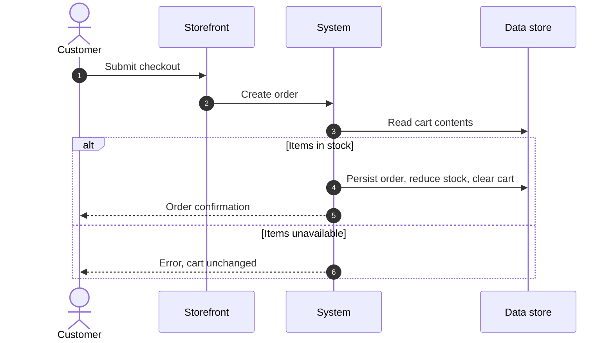

# Specification: Business Requirements Document Generation

**Artifact type:** authoring specification (a contract for an output document).
**Audience:** AI coding agents — Kiro, Claude Code, Cursor, Copilot, or any agent with filesystem read access and a shell.
**Applies to:** any technology stack. The output contract, evidence rules, and complexity rubric are language-neutral; stack-specific guidance for .NET, Java (Maven, Gradle, Ant), Node, Python, and Go is in Step 1 and §7. Nothing here assumes a particular language or build tool.
**Status:** normative. An agent that produces a BRD not conforming to this specification has failed the task.

---

## 0. What this document is, and what it is not

This specification defines **how to produce a Business Requirements Document (BRD)** for a software system by reading its source code. It is the input contract; the BRD is the output.

| This is NOT | Because |
|---|---|
| A steering document | Steering files are always-on behavioural rules for an agent working in a repo. This is a one-shot task definition, invoked deliberately. |
| A Kiro spec (`requirements.md` / `design.md` / `tasks.md`) | A Kiro spec drives *building a feature*. This drives *documenting a system that already exists*. |
| A BRD template to fill in | A template is a shape. This specification also defines the research process, the evidence rules, and the acceptance criteria that make the shape trustworthy. |
| The BRD itself | Do not edit this file with findings. Generate a separate document. |

### 0.1 How to invoke

| Tool | Invocation |
|---|---|
| **Kiro** | Reference this file in chat with `#docs/brd-generation-spec.md`, then state the scope. Or run it as a workflow step whose prompt includes the absolute path to this file. |
| **Claude Code** | `Read docs/brd-generation-spec.md and follow it to produce a BRD for <scope>. Write the output to <path>.` |
| **Any agent** | Supply this file's contents as the task instruction, plus §1's three required inputs. |

### 0.2 Required inputs from the requester

The agent **must** obtain these three values before starting. If any is missing, ask once, then stop — do not guess.

| Input | Example | If not supplied |
|---|---|---|
| `SCOPE` | "the whole BobsBookstoreClassic .NET monolith"; "the Struts claims module under `src/main/java/com/example/claims`"; "the checkout and order flow only" | Ask. Scope determines everything downstream. |
| `AUDIENCE` | "business stakeholders approving funding"; "the delivery team"; "an external systems integrator" | Default to business stakeholders approving funding, and say so in the document control block. |
| `OUTPUT_PATH` | `docs/brd/bookstore-modernization-brd.md` | Default to `docs/brd/<scope-slug>-brd.md`. |

Optional inputs: `DRIVER` (the business reason this work exists), `CONSTRAINTS` (budget, deadline, mandated platform), `EXISTING_DOCS` (paths to prior analysis to reconcile against).

---

## 1. Process the agent must follow

Do not begin writing the BRD until steps 1 to 3 are complete. A BRD written from assumptions is worse than no BRD, because it gets approved.

### Step 1 — Inventory before interpreting

Enumerate the system mechanically first. Record actual results, not expectations.

- Build and project files — see the per-ecosystem table below. Extract the target runtime and the **effective** dependency versions.
- Entry points: web controllers, API routes, CLI commands, scheduled jobs, message consumers, event handlers.
- Persistence: schema definitions, migrations, ORM mappings, seed/initializer code.
- External calls: SDK clients, HTTP clients, connection strings, queue and topic names, file and blob paths.
- Configuration: config files, environment variable reads, secret stores, feature flags.
- Infrastructure as code and CI pipeline definitions.
- Authentication and authorization enforcement points.

#### Where authoritative versions come from

**A declared version is not always the shipped version.** Read the manifest, then resolve the effective version with the build tool. Report the resolved value, and when the two differ, say so.

| Ecosystem | Manifests to read | Command that gives the authoritative answer | Trap |
|---|---|---|---|
| **.NET** | `*.sln`, `*.csproj`, `Directory.Build.props`, `Directory.Packages.props`, `packages.config`, `*.vbproj` | `dotnet list package --include-transitive` | Central Package Management moves versions out of the `.csproj` into `Directory.Packages.props`; legacy projects hide them in `packages.config` plus `<HintPath>` references. A `<Reference>` with a `HintPath` is a dependency even with no `PackageReference`. |
| **Java — Maven** | `pom.xml`, parent POMs, `.mvn/` config | `mvn help:effective-pom` and `mvn dependency:tree` | **Maven has no lock file.** `pom.xml` frequently omits the version entirely — it is supplied by a parent POM, `<dependencyManagement>`, or an imported BOM such as `spring-boot-dependencies`. Reading `pom.xml` alone yields a missing or wrong version. Multi-module builds need the aggregator, not one module. |
| **Java — Gradle** | `build.gradle`, `build.gradle.kts`, `settings.gradle`, `gradle.properties`, `gradle/libs.versions.toml` | `gradle dependencies` or `gradle :module:dependencies` | `gradle.lockfile` exists **only** if dependency locking was explicitly enabled. Versions may come from a version catalogue, a platform/BOM, or a resolution strategy that overrides the declaration. |
| **Java — Ant** | `build.xml`, `ivy.xml`, a checked-in `lib/` directory | None — inspect the JARs | Common in genuinely old estates. Versions may exist only in JAR filenames or `MANIFEST.MF`. Record what the manifest says and tag `[?]` where a JAR is unidentifiable. |
| **Node** | `package.json`, `package-lock.json`, `yarn.lock`, `pnpm-lock.yaml` | `npm ls --all` | `package.json` holds ranges, not versions. The lock file is authoritative. |
| **Python** | `pyproject.toml`, `requirements*.txt`, `poetry.lock`, `Pipfile.lock` | `pip freeze` in the project environment | Unpinned ranges in `requirements.txt` are not versions. |
| **Go** | `go.mod`, `go.sum` | `go list -m all` | `go.mod` may be superseded by `replace` directives. |

For the runtime itself, capture the **vendor as well as the version** (`R-64`). Look in the build config (`maven.compiler.release`, `sourceCompatibility`, `<java.version>`, `<TargetFramework>`), the CI pipeline's SDK or JDK setup step, the `Dockerfile`, and the container base image. These four disagree more often than not, which is itself a finding (`R-63`).

### Step 2 — Trace the primary flows end to end

Pick the flows that carry business value — for a commerce system: browse, add to cart, check out, fulfil, return. For each, follow the call path from entry point to persistence and back, naming the real classes and methods. These traces become §5 (workflow diagram) and ground §3 (lower level requirements).

### Step 3 — Classify every statement by evidence

Every factual claim in the BRD carries exactly one of these tags. This is the single most important rule in this specification.

| Tag | Meaning | Required form |
|---|---|---|
| `[V]` | **Verified.** Read directly in the code or a command's output. | `[V: app/Bookstore.Domain/Orders/Order.cs:34]` — path, and line or symbol |
| `[I]` | **Inferred.** A reasonable deduction from verified facts, but not stated anywhere. | `[I: inferred from X and Y]` — state the basis |
| `[A]` | **Assumed.** Supplied by the requester or industry-standard, not checked. | `[A: stated by requester]` or `[A: industry default]` |
| `[?]` | **Open question.** Not determinable from the repository. | `[?]` plus an entry in the Open Questions appendix |

Rules:

- `R-1` Business intent, SLAs, volumes, compliance obligations, and cost constraints are almost never in code. Tag them `[?]` or `[A]`. **Never** write them as `[V]`.
- `R-2` A requirement with no `[V]` evidence anywhere in its row is either `[?]` or it does not belong in the BRD.
- `R-3` Do not soften an unknown into a plausible sentence. "The system must support 10,000 concurrent users" with no source is fabrication. Write `[?] Peak concurrency target — not determinable from code; needs stakeholder input.`
- `R-4` When the code contradicts a prior document or a stakeholder statement, report the contradiction in both places. Code is the source of truth for *what the system does*; stakeholders are the source of truth for *what it should do*. Say which is which.

### Step 4 — Write the document per §2

### Step 5 — Self-check against §4, then report

---

## 2. Required output structure

The BRD contains these sections, in this order, with these exact headings. The eight numbered sections are mandatory and fixed. The document control block and the appendices are mandatory but may be dropped if the requester explicitly asks for only the eight.

```
Document control (table)
1. Summary
2. High Level Requirements
3. Lower Level Requirements
4. Upstream and Downstream Dependencies
5. Workflow Diagram
6. Architecture Design Diagram
7. Existing Technology Stack
8. Complexity Analysis
Appendix A — Traceability Matrix
Appendix B — Open Questions
Appendix C — Glossary
```

---

### Document control

A single table. No prose.

| Field | Value |
|---|---|
| Document title | |
| Scope | the `SCOPE` input, restated precisely, including what is excluded |
| Audience | the `AUDIENCE` input |
| Version / Date / Status | `0.1` / ISO date / `Draft for review` |
| Source of truth | repository name, branch, and commit SHA the analysis was performed against |
| Author | the agent and model that generated it |
| Evidence summary | counts: `n` verified, `n` inferred, `n` assumed, `n` open questions |

Recording the commit SHA is mandatory. A BRD generated from code is only true of one revision.

---

### 1. Summary

**Length:** 250–400 words plus the table. Written for someone who will read nothing else.

Must contain, in this order:

1. **What the system does** in business terms — two or three sentences, no technology names.
2. **Why this work is being proposed** — the `DRIVER`. If not supplied, derive it from evidence (an out-of-support runtime, a documented defect, a platform mandate) and tag accordingly.
3. **What is being asked for** — the requested outcome in one sentence.
4. **The headline constraint or risk** — the one thing that most shapes cost or feasibility.
5. **A summary table:**

| | |
|---|---|
| Business capability affected | |
| Primary driver | |
| Proposed outcome | |
| Overall complexity | T-shirt size from §8, with the single biggest driver named |
| Material risks | top three, one line each |
| Decisions needed before approval | count, cross-referenced to Appendix B |

**Prohibited:** the words "robust", "seamless", "leverage", "best-in-class", "cutting-edge". Describe; do not sell.

---

### 2. High Level Requirements

Business-level outcomes. What the business needs, independent of implementation. Typically 5 to 15 for a whole system.

Table, one row per requirement:

| Field | Rules |
|---|---|
| ID | `HLR-01`, `HLR-02`, … Sequential, stable, never reused |
| Requirement | One sentence, `shall` form, business vocabulary. No technology nouns |
| Rationale | Why the business needs it. Ties to the driver |
| Priority | MoSCoW: `Must` / `Should` / `Could` / `Won't` |
| Acceptance criteria | How a stakeholder confirms it is met. Observable, not internal |
| Evidence | `[V]` / `[I]` / `[A]` / `[?]` per §Step 3 |

Rules:

- `R-10` An HLR describes an outcome, not a mechanism. "Customers shall be able to purchase a book in a single checkout" is an HLR. "The system shall use an outbox table" is not — that is a design decision, and it belongs in §6 or in the architecture steering document, not here.
- `R-11` Preserving existing behaviour is a requirement and must be stated explicitly. A modernization BRD that omits "the system shall continue to do everything it does today" has invited scope loss.
- `R-12` Every HLR must have at least one LLR in §3. An HLR with no children is either not a requirement or the analysis is incomplete — say which.
- `R-13` Non-functional requirements belong here when the business cares about them (availability, data retention, auditability, regulatory). Each must be **measurable**. If the target number is unknown, the requirement is `[?]` with a placeholder, not a guess.

---

### 3. Lower Level Requirements

Implementable specifics. Each traces up to exactly one HLR. Typically 3 to 10 per HLR.

Group by HLR with a subheading per parent (`#### HLR-01 — <text>`), then a table:

| Field | Rules |
|---|---|
| ID | `LLR-01.1`, `LLR-01.2` — parent number, then sequence |
| Parent | the HLR ID |
| Requirement | One testable statement, `shall` form. Names the concrete behaviour, data, interface, or rule |
| Current behaviour | What the code does today, with a citation. `New` if no current equivalent |
| Acceptance criteria | Given/When/Then, or a precise assertion. Must be verifiable by a test |
| Type | `Functional` / `Data` / `Interface` / `Security` / `Performance` / `Operational` / `Migration` |
| Priority | MoSCoW |
| Evidence | per §Step 3 |

Rules:

- `R-20` One requirement per row. If the statement contains "and" joining two testable behaviours, split it.
- `R-21` Cite the real symbol. Useful: "Order totals are recalculated from current catalogue prices `[V: Bookstore.Domain/Orders/Order.cs — Order.SubTotal sums OrderItems x.Book.Price]`", or "Stock is decremented without optimistic locking `[V: src/main/java/com/example/order/OrderService.java:88 — reserveStock read-modify-write, no @Version]`". Not useful: "the order logic needs review".
- `R-22` **Record defects found during analysis as requirements, and flag them as behaviour changes.** When current behaviour is wrong, the BRD must state: what the code does, what it should do, and that fixing it is a deliberate change with a user-visible consequence. Silently specifying correct behaviour hides a change nobody approved.
- `R-23` Data migration and backfill are requirements, not implementation detail. If a new column must be populated for existing rows, that is an LLR with acceptance criteria.
- `R-24` Do not specify the solution's internals. "The service shall expose book stock levels to other components" is an LLR. "The service shall expose `GET /api/v1/books/{id}/stock` returning 200 with a JSON body" is an interface design decision — acceptable only if the requester asked for interface-level requirements, and it must then be tagged `[A]` or cross-referenced to the design authority.

---

### 4. Upstream and Downstream Dependencies

Definitions are fixed, because teams reverse them:

- **Upstream** — what this system consumes or needs. Data sources, services it calls, identity providers, platforms it runs on, and work that must complete first.
- **Downstream** — what consumes this system or is affected by changing it. Callers, data consumers, reports, integrations, and teams whose work is blocked.

Four parts, all required:

**4.1 Upstream — technical**

| Dependency | Type | Interface | Version / Support status | Owner | Criticality | Impact if unavailable | Evidence |
|---|---|---|---|---|---|---|---|

`Type` is one of `Runtime` / `Library` / `Service` / `Data store` / `Identity` / `Infrastructure` / `Third party`.
`Criticality` is `Blocking` / `Degrading` / `Cosmetic`.

**4.2 Downstream — technical**

| Consumer | How it consumes | Coupling | Breaks if we change | Migration needed | Owner | Evidence |
|---|---|---|---|---|---|---|

`Coupling` is `Contract` (API/schema) / `Shared data` / `Shared library` / `File or batch` / `Event`.

**4.3 Organizational and sequencing dependencies**

Work that is not code but blocks delivery: firewall and network change requests, licence procurement, security review, vendor contracts, hardware provisioning, data protection sign-off, training. One row each with owner and lead time.

**4.4 Dependency diagram**

A Mermaid `flowchart LR` with the system under analysis as a single highlighted node, upstream on the left, downstream on the right. Use solid arrows for synchronous calls and dotted for asynchronous or batch. Do not exceed roughly 20 nodes; aggregate rather than enumerate.

Rules:

- `R-30` Shared-database coupling is the dependency most often missed and most expensive to break. Search for other consumers of the same schema and state explicitly whether any were found, including when the answer is "none found, within this repository only".
- `R-31` Name an owner for every dependency, or write `[?] owner unknown`. An unowned dependency has no one to coordinate with.
- `R-32` Include support-lifecycle dates for runtimes and major libraries. An out-of-support dependency is a dated risk, not a preference.

---

### 5. Workflow Diagram

Business process flow — who does what, in what order, with what decisions. This is the *business* view, not the call stack.

Required:

1. **A diagram per primary flow**, at least the two or three that carry the most business value.
2. **As-is** always. **To-be** as well whenever the work changes the process.
3. **Actors as swimlanes or participants** — customer, admin, system, external party.
4. **Decision points and failure paths**, not just the happy path. A workflow with no error branch is incomplete.
5. **A numbered step table** beneath each diagram: step number, actor, action, system component involved, evidence citation.

Use Mermaid. `sequenceDiagram` when the ordering of interactions between actors matters; `flowchart TD` when decisions and branching dominate.



Rules:

- `R-40` Label steps in business language. "Reserve stock", not `ReduceStockLevel()`. Put the method name in the step table's evidence column.
- `R-41` Where the current process has a defect or an unexpected behaviour, annotate it on the as-is diagram with a `Note` and cross-reference the LLR.
- `R-42` Keep each diagram under about 15 steps. Decompose rather than produce something unreadable.

---

### 6. Architecture Design Diagram

Structural view. Two diagrams minimum, both required:

**6.1 Current state (as-is)** — what exists now, derived from the inventory in Step 1. Group by deployable unit. Show every data store and every external service actually referenced in code. Annotate each component with its runtime version.

**6.2 Target state (to-be)** — the proposed architecture. If a design authority already exists in the repository (an architecture decision record, a steering document, a design doc), the target diagram **must** match it and cite it rather than inventing an alternative.

**6.3 A component table** for the target state:

| Component | Responsibility | Owns data | Depends on | Changed from today | Evidence or authority |
|---|---|---|---|---|---|

Use Mermaid `graph TB` with `subgraph` blocks for boundaries — client tier, edge, services, shared libraries, data, external services. Keep direction consistent: clients at the top, data at the bottom.

Rules:

- `R-50` The as-is diagram is evidence-bound. Every box must correspond to something found in Step 1. No aspirational components.
- `R-51` Distinguish logical from deployment views. If the hosting platform constrains the design, say so here and reference the constraint.
- `R-52` Do not propose a target architecture the BRD has not justified. Every structural change must trace to an HLR or a named constraint.
- `R-53` Validate Mermaid syntax before delivering. A diagram that fails to render makes the whole document look unreviewed. Avoid unquoted special characters in node labels and avoid `<br/>` inside edge labels.

---

### 7. Existing Technology Stack

Factual inventory of what is in use today. Versions are the **effective** versions resolved per Step 1's ecosystem table — **never** recalled from memory of what version is current.

| Layer | Technology | Vendor | Version in repo | Latest / Target | Support status | EOL date | Risk | Evidence |
|---|---|---|---|---|---|---|---|---|

`Vendor` is required wherever it affects licence or support dates (JDK distribution, database edition, commercial libraries) and is `n/a` otherwise (`R-64`).

Layers to cover, omitting only those genuinely absent:

| | Layer | Notes |
|---|---|---|
| 1 | Runtime and language | Vendor and version (`R-64`). Language level separately where it differs from the runtime |
| 2 | Application server or host | **Java:** servlet container or app server — Tomcat, Jetty, WildFly/JBoss, WebSphere, WebLogic, GlassFish. Frequently the single largest migration cost item, so never fold it into "runtime". **.NET:** IIS, Kestrel, or a Windows service |
| 3 | Web, API, and UI framework | Spring MVC/Boot, Struts, JSF, Jakarta/Java EE, ASP.NET MVC, Web Forms, Razor, WCF |
| 4 | Platform API namespace | **Java:** `javax.*` versus `jakarta.*` — a hard, non-negotiable break at Jakarta EE 9 affecting every import, dependency, and app server. **.NET:** `System.Web` versus `Microsoft.AspNetCore` |
| 5 | Data access and ORM | Hibernate, JPA provider, MyBatis, JDBC, Spring Data, Entity Framework, EF Core, Dapper. Record the ORM version independently of the spec version it implements |
| 6 | Database engine | Engine, edition, and version. Edition drives licence cost |
| 7 | Authentication and identity | |
| 8 | Cloud SDKs and services | SDK major version, since major versions are breaking |
| 9 | Media, document, and image processing | Native-dependency libraries carry platform risk and are often licence-encumbered |
| 10 | Messaging and integration | |
| 11 | Logging and monitoring | **Java:** the facade and binding separately (SLF4J plus Logback or Log4j2) — a Log4j version is a security finding, not a preference |
| 12 | Build tooling and dependency management | Maven, Gradle, Ant, MSBuild, npm. Include the tool's own version |
| 13 | Containerization and base images | |
| 14 | Infrastructure as code | |
| 15 | CI/CD | |
| 16 | Test frameworks | |

Follow the table with:

- **7.1 Support and licence exposure** — every component out of support, within 12 months of end of support, or carrying licence terms that need a commercial decision. One line each with the date and the consequence.
- **7.2 Platform constraints** — anything in the current or target hosting platform that removes an option. State the constraint, its consequence, and the authoritative source.
- **7.3 Technical debt observed** — only what was actually seen in code, each with a citation. Not a generic list.

Rules:

- `R-60` `Support status` is one of `Supported` / `Ending within 12 months` / `Out of support` / `Unknown`, with a date for the first three. Verify end-of-life dates against vendor sources at generation time; do not rely on model knowledge for a date.
- `R-61` Licence terms that require a commercial decision must be named explicitly, not described as "may require review". This applies to the runtime itself: an Oracle JDK in a commercial deployment is a licence question with a cost attached, and a BRD that records only "Java 8" has concealed it.
- `R-62` If a version cannot be determined, write `[?]`. Do not write "latest".
- `R-63` Where manifests, CI configuration, and the container base image declare **different** runtime versions, record each with its source and identify which one produces the deployed artefact. The disagreement is itself a finding — it usually means the build and the runtime environment have drifted apart.
- `R-64` Record **vendor and version** for the runtime, not version alone, wherever the vendor is a licence or support variable. `net48` is a complete answer. "Java 8" is not — Oracle JDK, Eclipse Temurin, Amazon Corretto, Azul Zulu, and Red Hat OpenJDK differ in licence terms and in support end dates by years. The same applies to database editions and to any commercially licensed library.

---

### 8. Complexity Analysis

The section most often written as a vibe. It must be a scored, evidence-backed assessment that a reviewer can argue with.

**8.1 Scoring method**

Score each dimension 1 to 5 against these anchors, then apply the weight. A score needs a one-line justification with evidence.

| # | Dimension | 1 | 3 | 5 | Weight |
|---|---|---|---|---|---|
| D1 | **Scope and spread** | One component, few files | Several components in one repo | Many components, repo restructure | 15% |
| D2 | **Coupling and blast radius** | Isolated, no caller changes | A few known callers | Shared state or an in-process transaction that must be broken apart | 20% |
| D3 | **Data model impact** | No schema change | Additive columns | Schema split, backfill, or a change to historical values | 20% |
| D4 | **Integration count** | No external dependency | A handful, all documented | Many, some unowned or undocumented | 10% |
| D5 | **Platform and runtime change** | Same runtime and host | Minor version move | Runtime, OS, and hosting model all change — e.g. .NET Framework to .NET on Linux, or Java EE on WebSphere to Jakarta EE on a container with the `javax.*` to `jakarta.*` break | 15% |
| D6 | **Verifiability** | Existing automated tests cover it | Tests must be written, behaviour is clear | No tests, and correct behaviour is disputed or undefined | 10% |
| D7 | **Reversibility** | Revert a deployment | Revert plus a data fix | Not practically reversible once live | 5% |
| D8 | **Unknowns** | Everything verified | A few open questions | Core business rules undefined, or many `[?]` | 5% |

Weighted score to size: **1.0–1.8 S · 1.9–2.6 M · 2.7–3.4 L · 3.5–4.2 XL · 4.3–5.0 XXL**.

**8.2 Overall assessment**

| Dimension | Score | Weight | Weighted | Justification and evidence |
|---|---|---|---|---|
| D1 … D8 | | | | |
| **Total** | | 100% | **n.n** | **Size: _** |

**8.3 Per-requirement complexity**

Every `Must` HLR gets a row. This is what makes the section usable for planning and phasing.

| HLR | Dominant dimension | Score | Size | Why | Prerequisites |
|---|---|---|---|---|---|

**8.4 Complexity drivers**

The three to five specific things that make this hard, ranked. Each needs: what it is, why it is hard, where it is in the code, and what would reduce it. Be concrete — "an in-process transaction spans four aggregates and must be replaced with a compensating flow, see `<path>`" is a driver. "Legacy code" is not.

**8.5 What would reduce complexity**

Options with their trade-offs: reduce scope, keep a constraint, accept a known defect, extend a timeline, buy instead of build. State what each costs.

**8.6 Explicitly not estimated**

This section sizes relative complexity. It does **not** produce effort, duration, or cost. Say so. If the requester wants estimates, that is a separate exercise requiring team velocity and staffing, and the BRD must not imply it.

Rules:

- `R-80` No unjustified score. Every cell in 8.2 carries evidence or an explicit `[?]`.
- `R-81` High `D8` (unknowns) caps confidence. When D8 is 4 or 5, the assessment is labelled **Provisional** and the open questions are listed as blockers in the summary.
- `R-82` Never present a single number as the answer. The driver analysis in 8.4 is what a reader acts on.

---

### Appendix A — Traceability Matrix

| LLR | Parent HLR | Code evidence | Dependency refs | Acceptance test | Complexity |
|---|---|---|---|---|---|

Every LLR appears exactly once. Any LLR with no parent, or any HLR with no child, is a defect in the analysis and must be fixed before delivery, not footnoted.

### Appendix B — Open Questions

| ID | Question | Why it matters | Blocks | Owner needed | Default if unanswered |
|---|---|---|---|---|---|

`Q-01`, `Q-02`, … Every `[?]` in the document resolves to a row here. "Blocks" names the requirement IDs that cannot be finalised. "Default if unanswered" states what the BRD assumed in the interim, so silence does not become a hidden decision.

### Appendix C — Glossary

Domain terms, with the code symbol that implements each where one exists. Resolve ambiguous vocabulary explicitly — if the business says "offer" and the code means a resale submission, record both.

---

## 3. Formatting rules

- `F-1` GitHub-flavoured Markdown. Mermaid for all diagrams — no image files, no ASCII art, no external diagram links.
- `F-2` Tables for anything enumerable. Prose only for the summary, justifications, and driver analysis.
- `F-3` Every ID uses its fixed prefix: `HLR-`, `LLR-`, `DEP-`, `Q-`, `D` for complexity dimensions. IDs are stable across revisions; retired items are struck through, never renumbered.
- `F-4` File paths are repo-relative and in backticks. Line numbers where they aid review; symbol names where lines will drift.
- `F-5` No placeholder text, no `TBD`, no `TODO`, no lorem ipsum in a delivered document. Unknowns are `[?]` with an Appendix B row.
- `F-6` British or American spelling, consistently, matching the repository's existing documentation.
- `F-7` Write for the stated audience. A business-stakeholder BRD explains a technical constraint in one plain sentence before naming it.

---

## 4. Self-check before delivering

The agent must verify every line and report the result. Do not claim completion with a failing check — state what failed and why.

**Structure**

- [ ] All eight numbered sections present, correctly titled, in order
- [ ] Document control block complete, including the commit SHA
- [ ] All three appendices present

**Evidence**

- [ ] Every factual claim carries `[V]`, `[I]`, `[A]`, or `[?]`
- [ ] Every `[V]` citation names a path that exists — spot-check at least ten
- [ ] No business volume, SLA, or compliance claim is tagged `[V]`
- [ ] Every `[?]` has an Appendix B row; every Appendix B row is referenced somewhere

**Traceability**

- [ ] Every LLR has exactly one parent HLR
- [ ] Every HLR has at least one LLR
- [ ] Appendix A covers every LLR with no duplicates
- [ ] Every `Must` HLR has a row in §8.3

**Diagrams**

- [ ] Every Mermaid block parses — render or lint them, do not eyeball
- [ ] §5 has as-is, and to-be where the process changes
- [ ] §5 shows at least one failure path
- [ ] §6 has both current and target state
- [ ] Every §6 as-is component traces to the Step 1 inventory

**Technology stack**

- [ ] Every version resolved with the build tool per Step 1's ecosystem table, not read from a manifest alone and not recalled
- [ ] Runtime vendor recorded wherever it affects licence or support (`R-64`)
- [ ] Runtime version disagreements between manifest, CI, and base image reported (`R-63`)
- [ ] Support status and EOL dates verified against vendor sources at generation time
- [ ] Licence decisions named explicitly, including the runtime's

**Complexity**

- [ ] All eight dimensions scored with justifications
- [ ] Weights total 100% and the arithmetic is correct
- [ ] Size matches the computed score
- [ ] 8.4 names specific drivers with code locations
- [ ] 8.6 present — no effort or cost estimate stated or implied

**Honesty**

- [ ] Nothing asserted that was not checked
- [ ] Known defects reported as defects, with the behaviour-change consequence stated
- [ ] Contradictions against prior documents surfaced, not smoothed over
- [ ] Analysis gaps named in the delivery report

---

## 5. Anti-patterns

These are the failure modes that make a generated BRD worthless. Each has been seen in practice.

| Anti-pattern | Why it fails | Instead |
|---|---|---|
| **Plausible invention** — writing a credible-sounding SLA, volume, or compliance requirement with no source | It gets approved and becomes a contractual commitment nobody agreed to | `[?]` and an Appendix B row |
| **Restating code as requirements** — one LLR per class or method | Produces hundreds of rows, no business meaning, and nothing a stakeholder can approve | Requirements describe behaviour the business cares about; code structure belongs in §6 |
| **Defect laundering** — specifying the correct behaviour without noting the code does something else | Hides an unapproved behaviour change; historical data or reports may shift | `R-22`: state current, state target, flag the change |
| **Complexity by adjective** — "this is complex due to legacy architecture" | Unfalsifiable, unactionable, unplannable | §8 scoring with evidence and named drivers |
| **Happy-path-only workflows** | Error handling is usually where the business rules live and where the effort goes | `R-40` to `R-42`: branches and failure paths |
| **Version drift** — recalling library versions or EOL dates from training data | Confidently wrong; EOL dates in particular move and matter | Resolve with the build tool per Step 1; check the vendor source for dates |
| **Trusting the manifest** — reporting a version read from `pom.xml`, `build.gradle`, or `package.json` as `[V]` | Those files hold ranges, or no version at all when a parent POM, BOM, or version catalogue supplies it. The reported version is then simply wrong | Step 1's ecosystem table: `mvn dependency:tree`, `gradle dependencies`, `npm ls`, `dotnet list package` |
| **Version without vendor** — "Java 8" | Hides a licence cost and an support-date difference of years between distributions | `R-64`: vendor and version together |
| **Architecture freelancing** — proposing a target design that contradicts an existing design authority in the repo | Produces a document the architects reject wholesale | `R-52` and `§6.2`: match and cite the authority |
| **Scope silence** — not stating what is excluded | Everything is assumed included; the estimate is wrong from day one | Document control states exclusions explicitly |
| **Missing the shared-data dependency** | The most expensive coupling to discover late | `R-30`: search for it and report the result either way |
| **Burying the decisions** | Stakeholders approve without realising choices are outstanding | Summary table names the count; Appendix B lists them with defaults |

---

## 6. Delivery report

On completion, report in chat (not in the BRD):

1. Output path and section count.
2. Evidence summary: counts of `[V]` / `[I]` / `[A]` / `[?]`.
3. Overall complexity size and the single biggest driver.
4. **The top five open questions**, stated as questions, with who needs to answer each.
5. What could not be determined and why — missing repository access, absent documentation, behaviour only observable at run time.
6. Self-check result, naming any failed item.

Lead with the open questions and the gaps. A BRD's value is as much in what it surfaces as unknown as in what it documents.

---

## 7. Adapting this specification

- Repo-specific defaults belong in a short companion note (which repository, which branch, which design authority to honour in §6.2), not in edits to this file.
- To add a required section, add it to §2, define its rules, and add its self-check items to §4. A section with no acceptance criteria will be filled with filler.
- The eight numbered sections are the agreed contract. Do not reorder or rename them without the requester's explicit approval.
